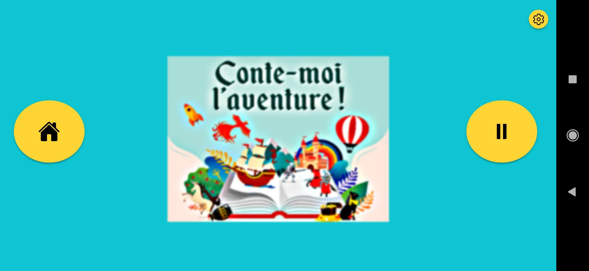
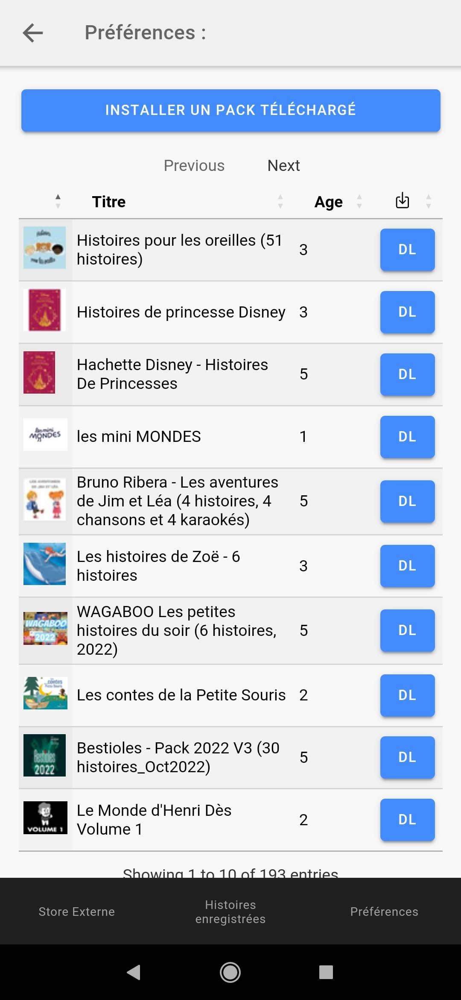

# Boîte à histoires :
*Read this in other languages: [English](readme.md), [Français](readme.fr.md)*
## How to use app :
- Download app from : https://github.com/Cyri1/bah/releases/latest (allow install from unkown sources)
- Download stories, all informations about how to download new stories are available on this Discord server : https://monurl.ca/lunii.creations 
- Add stories :
  - Unzip downloaded stories in Documents/packs/ folder.
  - OR
  - Install them directly from external store.
- Past unzipped archive stories in Documents/packs/ folder.
  Full path should be : Documents/packs/`name_of_your_story`/ , and inside `name_of_your_story`'s folder : 1 file `story.json` and 1 folder `assets` containing audios and pictures files.
- Set permissions to 'Allow management of all files' (needed to read story.json)
  
## Unsupported features (for now) : 
- iOS
- <del>Histoires interactives</del> ✔ Supported !
- <del>Téléchargement direct des histoires depuis un store custom</del> ✔ Supported !
- Auto update app
- Set favorites stories

## Screenshots : 

